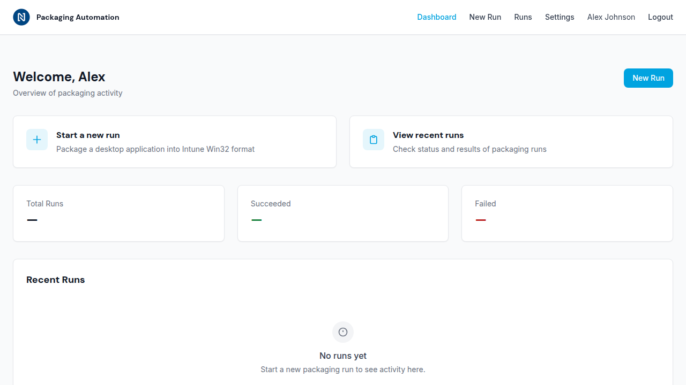

# Update 2 — Signed-in Dashboard

**Issue:** #2 — Signed-in dashboard
**Date:** 2026-03-19

## What changed

The template authenticated app was replaced with a real dashboard shell that shows the signed-in user and provides navigation to core pages.

### app/index.html — replaced template

The previous `app/index.html` was still the original scaffolding template. It used wrong branding (Rapid Circle, different color palette, Plus Jakarta Sans font) and showed generic content like "User Profile", "New Project", and "View Analytics" — none of which relate to the packaging automation app.

It has been replaced with a minimal Nouryon-branded page that immediately redirects to `/app/dashboard.html`. The SWA routing config already handles the `/app/` → `/app/dashboard.html` redirect (302), so this file is a fallback for anyone who navigates directly to `/app/index.html`.

### app/app.ts — fixed auth redirect

The shared app shell script had a bug: when a user was not authenticated, it redirected to `/oidc-callback.html` — a page that doesn't exist. This has been changed to redirect to `/` (the public homepage), which lets SWA's 401 response override handle the login flow naturally.

### app/dashboard.html — added quick-action tiles

Two new card-style tiles were added to the dashboard above the existing stat cards:

- **Start a new run** — links to `/app/new-run.html` with a description "Package a desktop application into Intune Win32 format"
- **View recent runs** — links to `/app/runs.html` with a description "Check status and results of packaging runs"

Both tiles use the established card component pattern with hover effects and are linked to the correct (placeholder) pages.

## Screenshot

