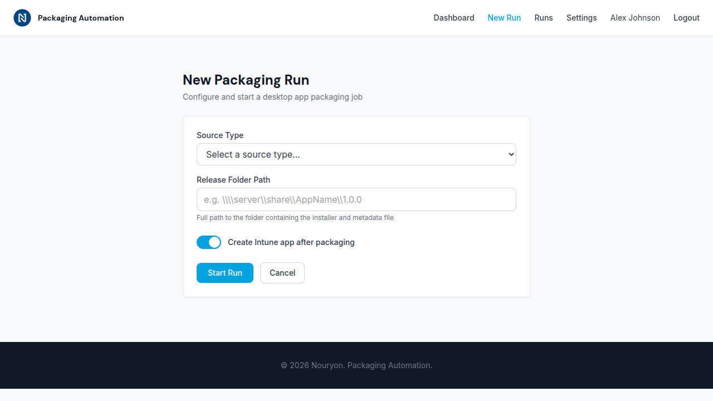

# Update 3 — New Run Form (Issue #3)

**Date:** 2026-03-19

## What Changed

Added the **New Run** page (`/app/new-run.html`) where authenticated users can start a packaging run by entering a release folder path and selecting options.

### New Files
- **`app/new-run.html`** — New Run form page using the shared app shell (nav, footer, mobile dialog menu) and DESIGN.md form layout (`max-w-2xl`). Contains a source type dropdown, release folder path text input, "Create Intune app" toggle, and Start Run / Cancel buttons. Status area shows loading, success, or error messages inline (no browser alerts).
- **`app/newRun.ts`** — TypeScript module that handles form validation, toggle state, and form submission to `POST /api/packaging/run`. Waits for the `app-shell-ready` event before initialising, so the user is always authenticated. Displays inline error/success feedback and links to the run detail page on success.
- **`docs/screenshots/03-new-run.png`** — Screenshot of the New Run page at 1280×720.
- **`docs/updates/update-3-new-run-form.md`** — This file.

### Updated Files
- **`.gitignore`** — Added `app/newRun.js` and `app/newRun.js.map` to prevent compiled output from being committed.
- **`docs/BUILD_LOG.md`** — Added Update 3 section.

## Design Decisions

- **Form layout** follows DESIGN.md's Form page type: single-column card with `max-w-2xl mx-auto`.
- **Toggle** uses an accessible `<button role="switch" aria-checked>` pattern instead of a checkbox, matching modern SaaS toggle conventions.
- **Validation** is client-side only (required fields: source type, release folder path). Errors clear on input change.
- **Status feedback** uses DESIGN.md toast/notification patterns (green for success, red for error, blue for loading) — no `alert()` or `confirm()` calls.
- **Navigation** marks "New Run" as the active link (primary color, no hover class) in both desktop and mobile menus.
- **Backend readiness** — the form POSTs to `/api/packaging/run` with `{ sourceType, releaseFolderPath, createIntuneApp }`. The backend endpoint will be implemented in Issue #4; the UI is fully wired and ready.

## Screenshot

