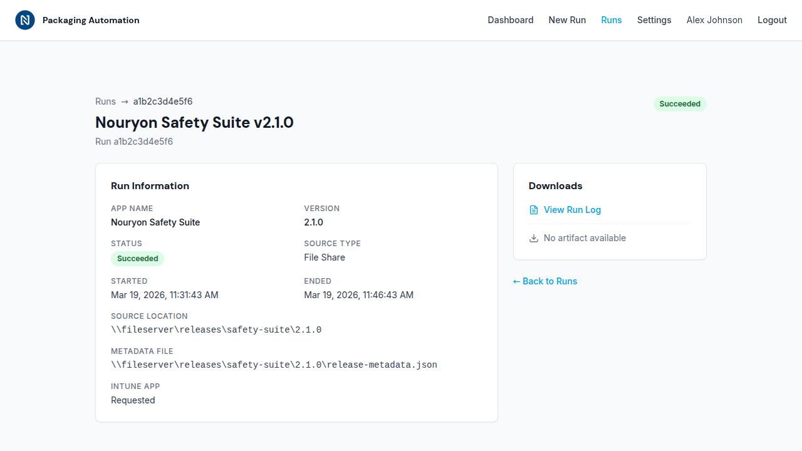

# Update 6 — Run Details and Downloads

**Date:** 2026-03-19
**Issue:** #6

## What Was Done

This update adds a run detail view that shows full metadata for a packaging run, along with log viewing and artifact download links.

### Backend

- **GET /api/packaging/runs/{runId}** — new endpoint that looks up a single packaging run by its run ID across all app partitions. Returns full run metadata including source location, metadata file reference, Intune configuration, and signed URLs for log and artifact blobs.
- **StorageService.GetRunByIdAsync** — queries the PackagingRuns table filtering on the `RunId` property, scanning across all partitions to find the matching record.
- **StorageService.GenerateBlobSasUrl** — generates time-limited SAS (Shared Access Signature) URLs for blob storage items. Used to create read-only links for run logs and artifacts that expire after 30 minutes.
- **SeedPackagingRuns** — new seed data function at `POST /api/manage/seed-packaging-runs` that creates four sample packaging runs (two Succeeded, one Running, one Failed) with uploaded log blobs for completed runs.

### Frontend

- **app/run-detail.html** — detail page using the DESIGN.md Detail layout (`max-w-5xl mx-auto`). Features a breadcrumb header with status badge, two-column layout on large screens (metadata summary on the left, downloads/links on the right), and graceful handling of missing logs or artifacts.
- **app/runDetail.ts** — TypeScript module that reads the `id` query parameter, fetches run details from the API, and renders the page. Handles loading, error, and not-found states.
- The runs list (`app/runs.ts`) already linked to `run-detail.html?id=...` from the previous update — no changes needed.

### Configuration

- Added `/api/manage/seed-packaging-runs` anonymous route to `staticwebapp.config.swa.json`.
- Added the seed endpoint to the "Seed Demo Data" button in `index.html`.

## Screenshot

